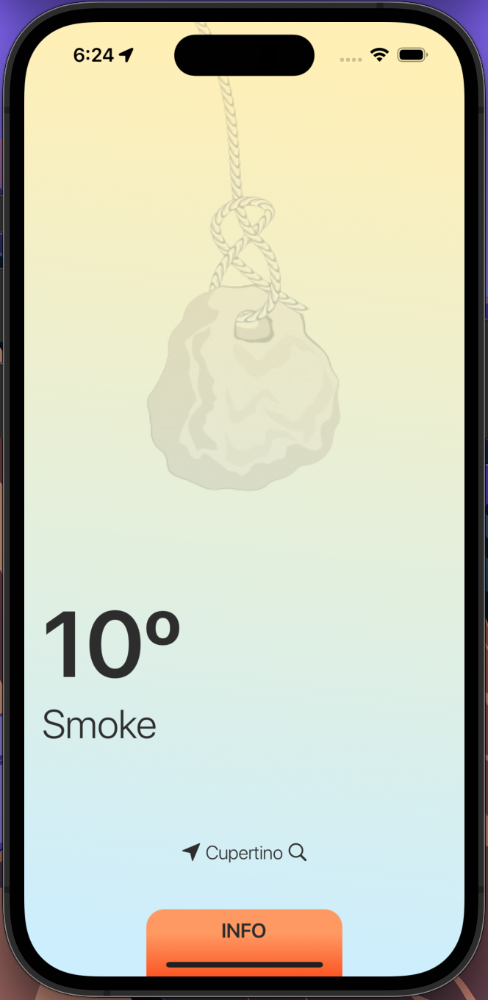
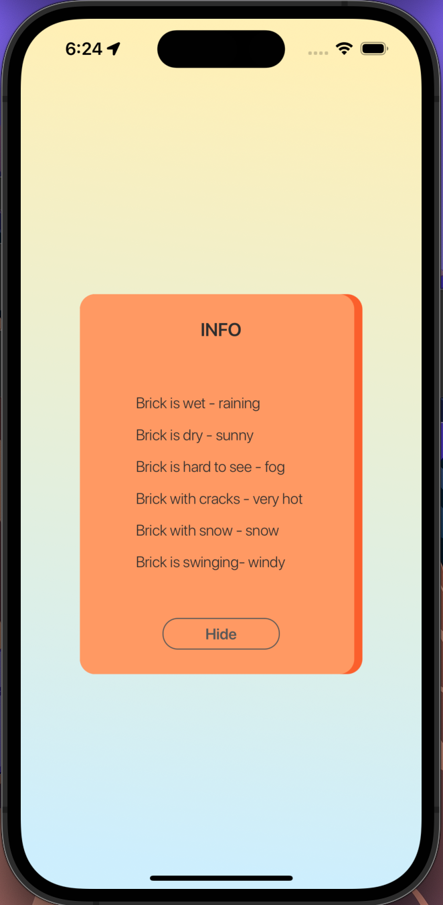

# BrickWeather
Application that works with the location and weather API.

## API

- [Beer API](https://openweathermap.org/current)

| Weather | Info | 
| :-----: | :--: | 
 |  |

## Shared

Package Management - Cocoapods

Location - CoreLocation

UI - SnapKit

Network - URLSession

````
$ pod install
````
## 💕 THANK YOU FOR YOUR ATTENTION
